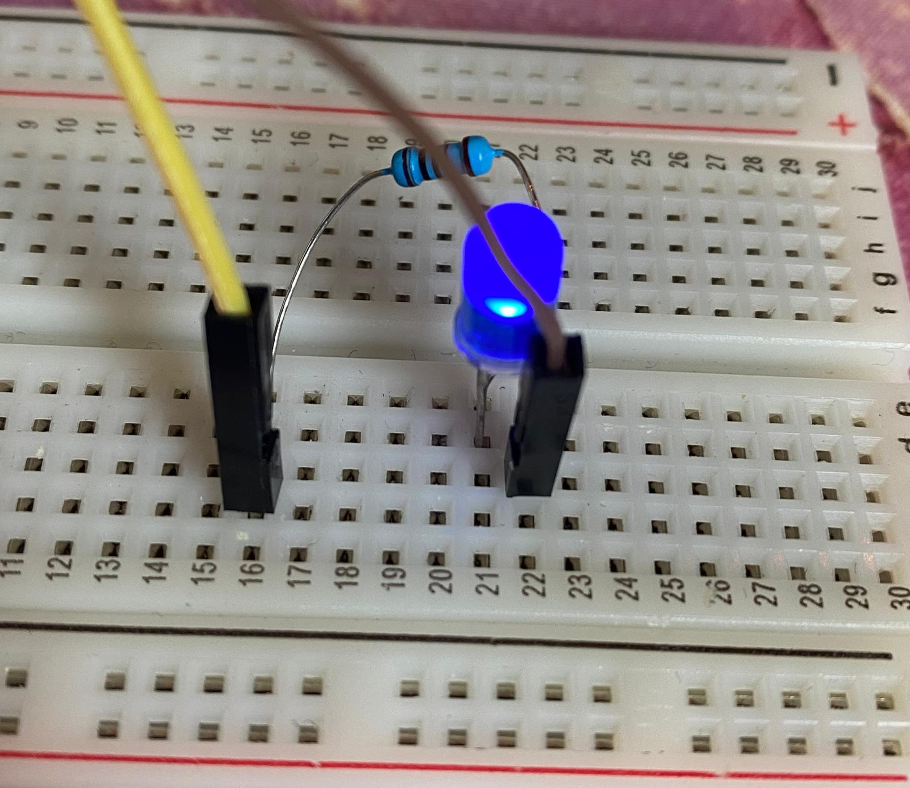
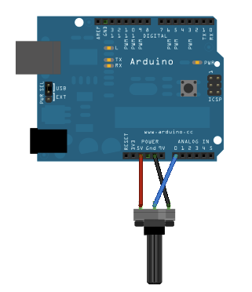
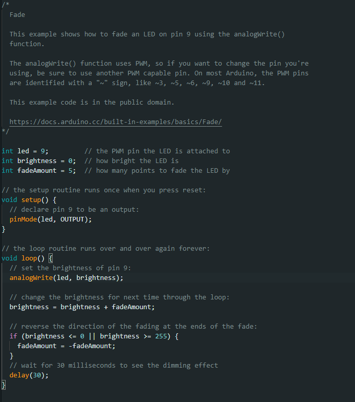
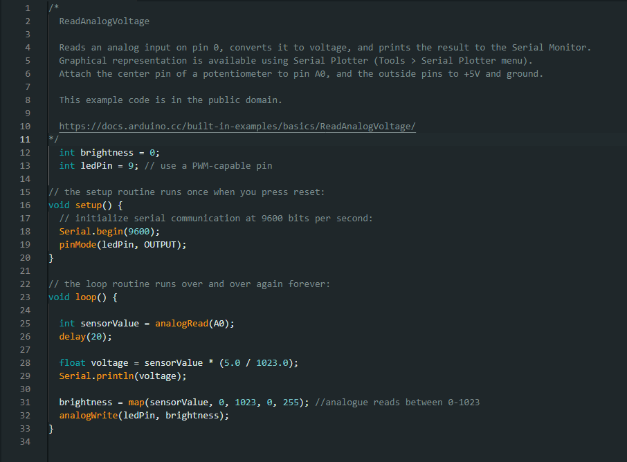

# Entry 1 - Blink and Fade

>### New components used:
>- **Arduino** - A versatile microcontroller used to combine hardware components (such as wires and bulbs) with an Integrated Development Environment (IDE) to create working circuits and interactive products.
>- **Breadboard** - A device composed of small, metallically connected holes, used to build electronic circuits for ease of rearrangement.
>- **Resistor** - A component used to police the flow of electricity in a circuit in order to ensure all components receive their desired voltage.
>- **LED Bulb** - A small static device that produces light when powered.
>- **Potentiometer** - An analogue resistor that controls electrical signals on a dial.

After a brief period of visually familiarising myself with the Arduino's layout, the **ATMEGA328P** chip, the syntax for the IDE software - among other intricacies - I felt compelled to witness these physical components working together purposefully, and utilise the hardware supplied to me.

Given an absence of prior knowledge regarding hardware of this kind, I knew I needed to start simple. Opening up the Arduino IDE on my laptop, I located the rudimentary 'Blink' example code (responsible for sending periodic voltage to the built-in bulb to create a blinking effect) and ran it. Much to my delight, the small LED located on my Arduino began to flash in accordance to the speed set within the code example. Despite this success, I still felt a degree of dissatisfaction, given that I'd only used an example program and no components of my own. In order to combat this, I turned to my Arduino kit.

 ### The Blink Experiment

Initially, I believed the process of setting up a bulb circuit to be a mere case of plugging the LED into the breadboard, paired with a wire for current supply and another for ground. However, a brief conversation with my lecturer indicated this not to be the case. I was introduced to the premise of a **resistor**, and it's importance in the maintenance of a circuit's functionality. Additionally, upon closer inspection of the 'Blink' example code, I noted the initialisation of the bulb with the correspondence to pin 13 on the Arduino board, precisely indicating the desired source of power for this particular program.

With this information in mind, I began my circuit. Plugging a wire into the pre-mentioned 13th pin, I plugged the other end into the breadboard to supply electricity. Upon the same (and therefore electronically linked) row, I placed one resistor pin, the other to slotting into a pin several rows down; allowing myself adequate space to work with such small components. Within the row of this secondary resistor pin, I placed the bulb's **anode** to receive the positive side of the power source, with the **cathode** falling onto the adjacent row to push the current back to the Arduino's ground pin via a second wire. After re-running the IDE program, the LED bulb began blinking as intended.

Despite its simplicity and pre-written program, this was my first ever circuit, and I was thrilled to see components that I had personally arranged working collaboratively to serve one purpose. Watching the bulb light up for the first time brought me a great sensation of accomplishment, and I was immediately determined to experiment further with this hardware.

---

### The Fade Experiment

Using the same approach as the previous experiment, I located another of the IDE's simple example programs called 'Fade', as it utilised similar components to the already assembled circuit. Contrarily, this program utilised **analogue** voltage (current over a range of quantities as opposed to static on/off values) in order to linearly increase bulb brightness. Therefore, I needed a component capable of supplying power of this format. Upon inspection of my Arduino kit, I found a **potentiometer** which could act as a dial providing this kind of input. This particular program called for a notably different pin (9), which provided me insight into the way Arduino handles compatibility between analogue and digital outputs.

After integrating this new component into my 'Blink' bulb circuit by drawing voltage directly from the analogue value of the potentiometer's dial rotation, I had a circuit adequate for the 'Fade' program. However, after running this code with my Arduino, I was surprised by the outcome. Instead of the desired 'gradual increase' in brightness, the dial's rotation acted more as a threshold, with a certain degree of rotation indicating the activation of an automatic bulb 'fade pattern' as opposed to an undeviating correlation between revolution and bulb brightness. While this was an indication of the IDE's ability to successfully read dial rotation, it wasn't what I had in mind, so I subsequently modified the script to achieve my intended result. 
>The **original** fade program:

>The **modified** program I arrived upon:

I removed the 'fadeAmount' variable, as I no longer intended for the LED's voltage to be governed inside of the script. Instead, I wanted all input to come solely from the dial reading. The potentiometer operates in values between 0-1023, as opposed to the bulb's 0-255 readings. This meant that I needed to translate the analogue reading into the latter metric (hence the use of the map function). Passing in this converted value allowed the brightness to be directly correspondent to the continuous output provided by the potentiometer. 

I found the result of my homemade program to be much more satisfying than the one prior. The added element of environmental interactivity makes for an intuitive experience, making the LED's brightness a direct consequence of my fingers as they rotated the potentiometer, rather than just an 'animation' trigger. This was my desired outcome, and I achieved it through modification of an existing script, familiarising me with the format and procedure for writing Arduino-compatible programs. Additionally, I found this process to be greatly educational in the context of greater physical computing, as it introduced me to the importance of the **Input ↛ Process ↛ Output** pattern that applies to almost every real electronics system. I had to think in greater detail about the method of input capture, and the process in which said input would need to be translated, and received by the output component; the result was a working circuit. This exploration amplified both my confidence and understanding among the hardware provided, in addition to a ripe keenness to be adventurous with consequent experiments.

**SEE FADE VIDEO RESOURCE ATTACHED IN FOLDER**

---