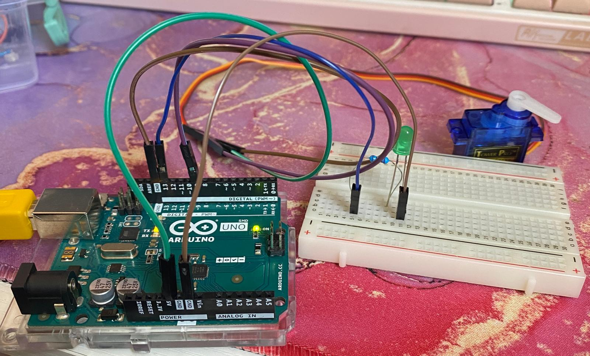
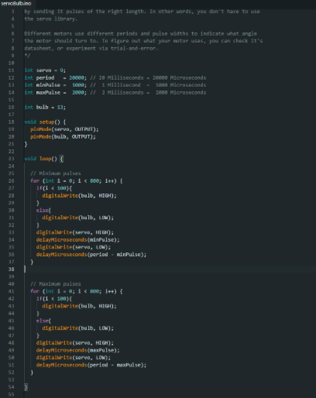
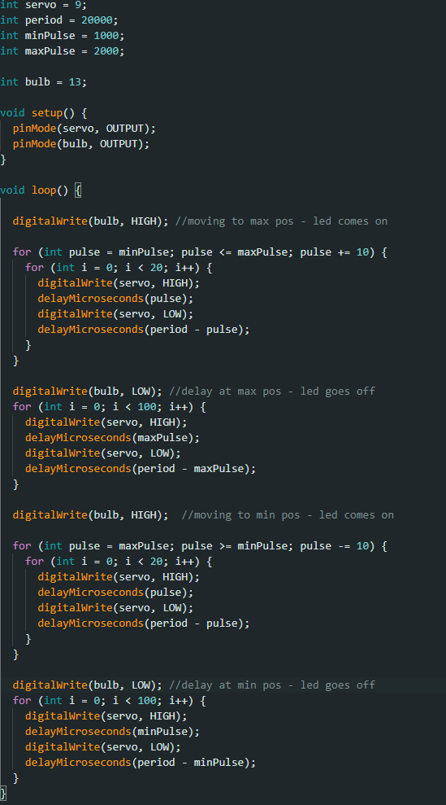

# Entry 2 - Motor Bulb

>### New components used:
>- **Servo Motor** - A rotating component that allows for the measure of angle, position or velocity using an inbuilt sensor.

After gaining some experience with the construction and interpretation of a successful circuit, I was intrigued to explore alternative conditions for electricity flow. I was especially interested in the movement and environmental aspect of the potentiometer, and wanted to explore hardware of a similar 'real-world governable' variety. This is what drew me to begin experimenting with motors.

Within my Arduino kit, there were three types of motor:
 - A **DC Motor** - responsive and easy to set up, though rudimentary and with limited control.
 - A **Servo Motor** - able to record precise angle measurements, though has limited movement range.
 - A **Stepper Motor** - even greater movement precision, though is slower and sacrifices power.

 Due to the limitations of the other two motors, I decided to experiment primarily with the **Servo Motor**, as a comfortable middle ground between speed and precision. Its back-and-forth gesture providing clear variables for me to work with (in motion, not in motion, left position, right position etc.). To follow through with my concentrated interest in 'movement interactivity', my objective was to encourage electricity flow when the motor was in motion, and too limit it when stationary.

### The Experiment

After deciding on the primary component and objective of my experimentation, I began to assemble the circuit. Again, the servo motor provided an analogue output, therefore was connected accordingly to a capable pin on the Arduino. The circuit itself took an almost identical format to that of the potentiometer experiment, and so the hardware was straight forward enough to assemble coherently - thanks to my prior experimentation. However, it was in the IDE configuration which problems began to arise.

I assembled a program capable of reading input from the servo motor, and then creating thresholds with that input within which the LED bulb would turn on. The first complication I came across was that of the motor's dual-direction. I failed to realise that the two extreme angles (0 and 180 degrees) had two separate values that needed to be taken into account (as opposed to a single 'maximum position' value), therefore, my first test resulted in the bulb's response from one angle, but not the other. To combat this, I provided the IDE with two separate variables labelled 'maxPulse' and 'minPulse', thus separating the two extremes; in addition to a third variable: 'period', which acted as the standard 20 millisecond servo cycle duration. After some experimentation, I arrived at the following script:

The outcome of this script was as follows: the motor would reach one extreme position and send a brief signal to the LED bulb, prompting its activation; then a small delay, during which the bulb would switch off. Subsequently, the motor would angle itself immediately over to the alternative extreme, where the bulb signal would briefly fire once more and be succeeded with a delay. This loop repeats indefinitely. While this approach did _technically_ achieve my initial objective of electrical current governed by the movement of a motor, it was clunky and accidental - more dependent on the time it took the motor to rotate from one extreme to the other, rather than the angles themselves. Additionally, the bulb would only fire once at either end of the cycle, not while the motor was in motion, nor even for the entire duration of it's stationary delay. The LED's deactivation depended entirely on an else statement - essentially saying 'if the motor isn't at an exact position, turn the bulb off'. This made the whole lighting response look random and juvenile. 

With these criticisms in mind, I began on my second draft, and arrived at the following program:

The LED comes on at the beginning of the loop where the motor begins to move from its minimum position to its maximum. I wanted the motor to be recorded as it moved fluidly from A to B, rather than hopping between values - so I revised my logic, nesting a much smaller iteration within the overarching for loop. This approach catered to my desire for more exact angle measurement, as the motor now moved in continuous, smaller and recorded amounts, as opposed to one large sweep. After playing with values, I found 5 to be too fast and jittery, and 50 to be sluggish and unnecessary, hence the 'sweet spot' value of 20 in the nested for loop.

Once the motor had reached its maximum position, I added a halting period to prevent any movement for a finite amount of time at either end of the cycle. During this period, the LED was manually switched off, not re-lighting until the delay had concluded, signalling the rotation of the motor once more. This was a much more intentional, and therefore clean and reliable, cue for the bulb compared to the prior program's 'else' logic. This functionality would then repeat as the motor made its way towards the minimum position. The result was clean and predictable, leaving me with a much more polished and functional circuit. When the motor moves, the bulb comes on. When the motor is stationary, the bulb stays off.

The final result achieved my original goal, providing me with a circuit that was dynamic and movement-centred. The bulb's ignition in exact correlation to the motor's movement was satisfying to view, and felt environmental. Experimenting with this component gave me a better insight as to how moving parts and their angles/speed can act as an interesting and versatile variable for the triggering of electrical current, opening the door for more motion-based circuit ideas, such as moving robotic 'limbs', or lens focusing. Similarly, having an unsuccessful prototype gave me additional experience in debugging and a better understanding of this component's individual requirements and how they differ from that of other components. The contrast, strengths and weaknesses between hardware is what makes physical computing so varied and interesting.

---