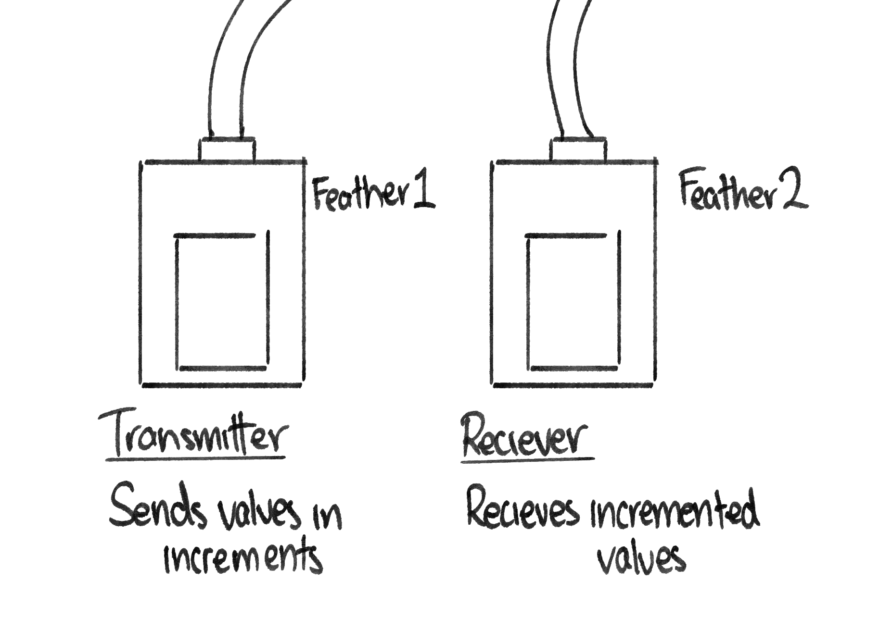
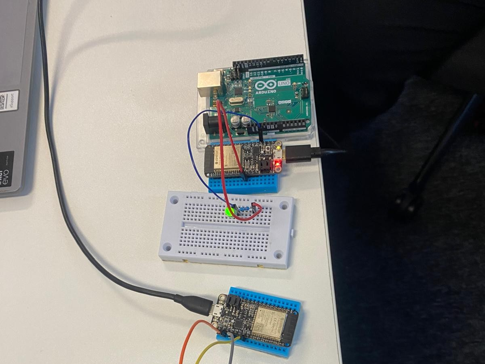
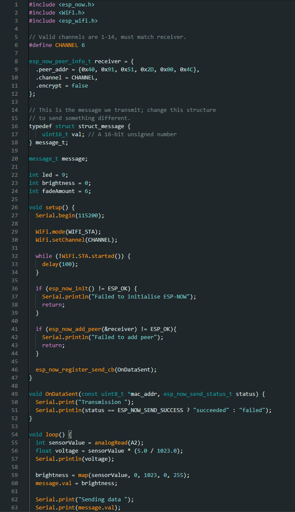
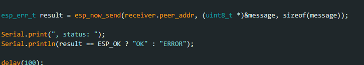

# Entry 3 - WiFi Communication

>### New components used:
>- **Adafruit ESP32Feather** - Small, WiFi & Bluetooth compatible microcontroller used for wireless communication and web server hosting.

The **Adafruit ESP32Feather** was introduced as a small component capable of opening a whole new realm of possibility into my physical computing journey. Given my developing interest in circuits with a degree of environmental responsiveness, components with the capacity to communicate and respond to one another _across_ an environment (i.e. without any physical connection) could prove to be a game changer.

After doing some research on the nature of the Adafruit microcontroller, I began to understand its more basic principles. For example, WiFi-operated components require an inbuilt module for conversion between analogue and digital readings, therefore are incompatible with analogue input pins; additionally, that two microcontrollers are required to communicate with one another. The latter premise was demonstrated more effectively within the context of an IDE example program in which one microcontroller (acting as a **transmitter**) sent incrementing numbers in a rhythm to another microcontroller (acting as a **receiver**) which then printed these numbers to the console. This connection was established via a **port** - a unique code acting as a wireless 'channel' - which was instantiated by the transmitter and entered into the receiver.

This example was an interesting demonstration of the nature and capabilities of wireless connections, however, its nature was vasty different to that of the very primitive circuits I had been assembling thus far. I was keen to familiarise myself with this new, more complex adaptation, and to facilitate this understanding, I turned to familiar components.

Using corresponding pins on the Feather, I recreated the basic 'Blink' circuit from my early experiments, altering the WiFi example program so that - keeping the initial rhythm - the transmitter program would send positive readings instead of incrementing integers, which the receiver would then, by converting these readings into cues to release current, would power an LED bulb. This created a wireless alternative to the previous 'Blink' experiment, with the bulb activating with each cue for power, and deactivating in the delay between signals.

With this circuit functioning as intended, I was keen to take it a step further, wanting to see a result less static and more user determined. To achieve this, I called once more on my potentiometer, hooking it up to the breadboard in the exact same way as in my previous experiment, with the dial's analogue reading being converted into a 'brightness' value for the bulb. Upon initialisation of this modified program, I noticed that - the bulb's brightness was being impacted by the potentiometer while equally maintaining its 'blink' rhythm via the transmitter - technically making this circuit a success, however, the transmitter was still only sending very basic positive values in a static rhythm. I felt like I wasn't using my wireless components to their full capacity.

To combat this, I disconnected my potentiometer dial from my LED, and connected it instead to the transmitter's breadboard, having my bulb directly connected to the receiver. I modified the transmission program to take the potentiometer's analogue reading, converting this reading into the metric used by the bulb to indicate brightness, then passing this value consistently across the sever without the incremental delay for a seamless brightness response. Then, I modified the receiver code to directly receive this input, and immediately change the bulb's brightness to correspond with the constantly transmitted values. The result was a remote 'fade' circuit which allowed users to turn the potentiometer dial and watch as the bulb's brightness altered in response despite seemingly being entirely separated.

**SEE WIFI VIDEO RESOURCE ATTACHED IN FOLDER**

This experiment was a combination of old and new, reinforcing my understanding of components used in previous experiments, while introducing me to new - more complex - concepts. Wireless circuitry is an incredibly flexible resource, allowing programmers to create tech independent of spatial constraints, and accessible to people in multiple locations. This premise is essential in today's era of internet usage, and I am pleased to have developed a greater understanding of how this technology is initialised. I believe my efforts to properly utilise said components to their full potential aided in this understanding, and I look forward to expanding my understanding further.

---