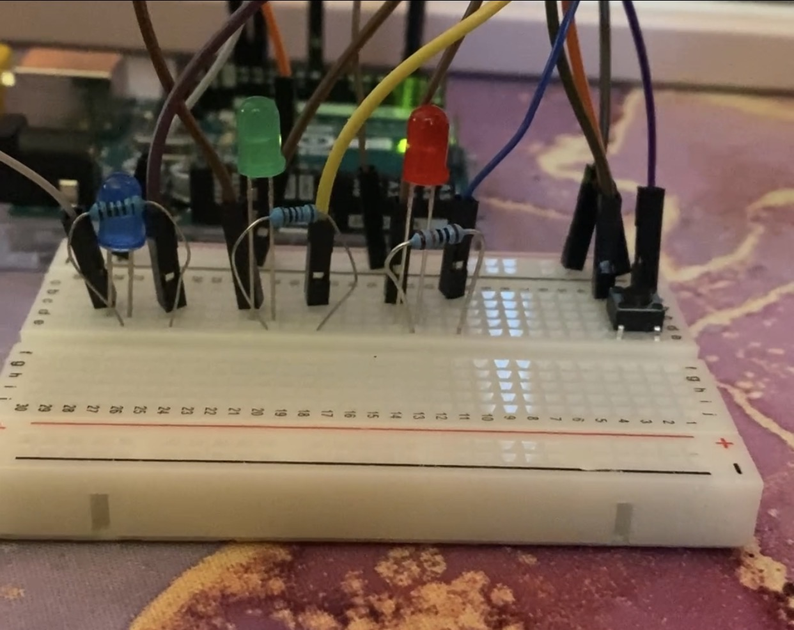
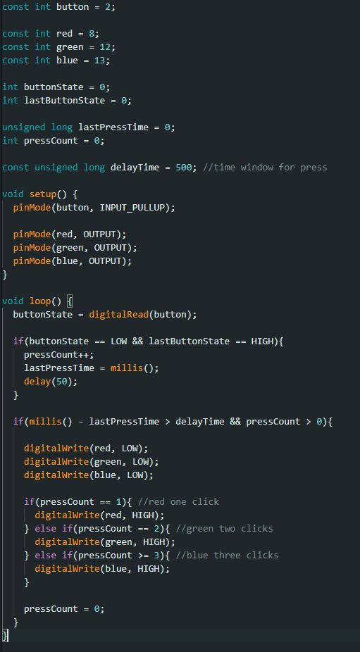
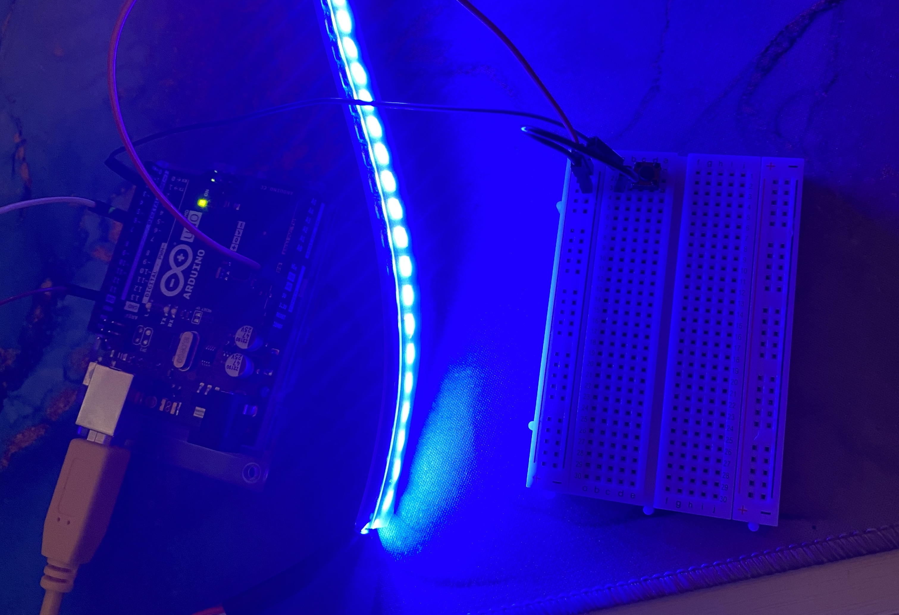
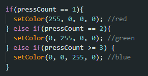

# Entry 4 - Initial Concept

>### New components used:
>- **Button** - Small switch acting as a means to handle input.
>- **Neo-pixel LED strip** - Rope of coloured GRBW lights each independently governable via microcontroller.

In order to come up with an appropriate idea for my final project, I wanted to lean into what I'd already learned - particularly, what of my prior experiments had engaged me the most. The theme of dynamic environmental/user influence as opposed to static results was what immediately sprung to mind, as I had been intentional with my inclusion of this principle in every one of my experiments thus far; I wanted to ensure the continuation of this theme. However, there was one other common concept that had acted as an accidental and yet essential influence in each exploration, and that concept was light.

Subconsciously, I had begun to associate the illumination of a bulb as 'success', indicating functional software and an electronically capable circuit. I realised that having something bright and colourful to "reward" me for my efforts was something I greatly appreciated, and wanted to expand upon in my final project. This train of thought had me considering the combination of both user input and lights, and the idea I arrived upon was a coloured light selection tool.

### The Bulb Experiment

If I wanted user interaction to catalyse a reply from coloured lights, I needed a way in which to capture this input. Looking inside my Arduino kit, I found a small **button**. Connecting one side of this little component to an Arduino pin and another to ground - alongside a properly connected LED bulb and a primitive input capture IDE script - I was able to create a circuit in which pressing the button would cause the bulb's activation. Adding the element of selection was simple enough from a hardware standpoint, I merely had to connect a few different coloured bulbs into the breadboard, each corresponding to a separate pin on the Arduino. However, the software modification for such an upgrade in complexity required more thought.

I created several different variables: one for the button pin, one for each bulb pin, several for the recording and management of button activation. I wanted my program to change the resulting colour depending on how many button clicks had been inputted, so I made sure to record not only the amount of times clicked, but equally the time between clicks to indicate whether they were intentionally relevant. The script's core loop was centred around reading the button's state and then appropriately incrementing the 'pressCount' variable, which's value would then indicate the bulb's pin that should receive power. One click for red, two clicks for green, three clicks for blue. If no buttons had been pressed for a specified amount of time, any activated bulb would be switched off to conserve power and enable the program to be reused.

**SEE MOOD SELECT BULBS VIDEO RESOURCE ATTACHED IN FOLDER**

With the program working without a hitch, I was pleased with its success. I had become familiar with the standard format for button input capture, and created a circuit that could dynamically change which bulb was the recipient for power. Though, despite the fact that input was _technically_ changing the illuminated colour, no actual colour change was occurring within the script - and the visual difference was only as a result of multiple bulbs that just happened to be hued differently. This factor made the end product feel unreliable and incomplete, and I wasn't satisfied that my original goal of 'user dependent colour shift' had been catered to. In order to better suit this brief, I knew I needed to turn to components more complex than simple static bulbs.

### The Strip Experiment

Research into the wide variety of light and colour emitters opened my eyes to a number of possible avenues on which to take my project. From Bluetooth bedroom bulbs compatible with the ESP32Feather, to electrical ignition propane gas lanterns, general consensus in the illumination world is that the safest, most sophisticated, most obtainable option is the **LED strip**. There was particular celebration of the **NeoPixel** variety for it's depth of colour and ease of control, with each individual bulb having it's own positional identification, therefore allowing for independent programmability. I knew this degree of responsiveness would be  pleasant to work with, and such versatility would prove useful upon the expansion of my project further down the development pipeline. Additionally, a component with such complexity would provide an adequate 'step up' from my prior experiments. With these factors in mind, I obtained a strip of NeoPixel LED lights.

With the IDE pre-configured to handle input clicks in succession, I carefully removed the three bulbs without dismantling the button circuitry. Providing the LED strip with its own power source (as the Arduino pins can only produce an inept output of up to 5 Volts), I connected the strip to both ground and an input pin. From this point, it was only a matter of modifying the IDE program to be suited to this new component, as opposed to the prior trio of bulbs.

In order to modify the script, I included the 'Adafruit_NeoPixel.h' library at the top of the file to ensure that the basic functions required for the functionality of these new lights would be easily accessible. Furthermore, the strip I obtained had a colour configuration of GRBW as opposed to the standard RGB, requiring an additional line of initialisation the elimination of unexpected colour behaviour. From this point onwards, the majority of the program's prior logic remained intact, including the window for button clicks and the incrementing press counter. However, where a set number of presses once changed the current's recipient pin, that same variable was now responsible for sending colour cues to an already powered series of lights in the form of numeric GRBW values. One click for red, two clicks for green, three clicks for blue - just like before - except this time, the hue shift was as a result of reading dynamic data within a lone component; intentional, reliable and much more technologically commendable.

**SEE MOOD SELECT STRIP VIDEO RESOURCE ATTACHED IN FOLDER**

This duo of experiments reinforced my understanding of some key principles within physical computing, most notably the art of experimentation. While I can now comfortable navigate both the workflow and the hardware provided to me, this was the first instance in which I synthesised a functional product from a mere idea, reviewed the results, and then used those results to make improvements. This experience not only made me feel better equipped to handle hardware hiccups and unexpected outcomes, but additionally gave me an opportunity to think about a core concept when developing projects such as these: the user experience. Users want reliable tools with consistent outcomes, not redundant code and coincidental success. Meeting this industry standard is what encouraged me to consider the quality of my product, and expand my horizons with more refined hardware - despite the fact that it was unknown.

In regards to my final project, I was confident in the progress I had made within these experiments and was eager to expand upon what I had created. Looking down at the results, I considered what real-world objective would be tended to by my product - an illuminated 'colour selector'. While my components had experience an upgrade, my concept was still undeveloped and dependent on an input both repetitive and manual. This did not cater to my desire for 'environmental influence'. Taking this variable into consideration, I mulled over potential alternative inputs that could act as an influence for my light strip display. I wanted an outside source to be collected or 'sensed' electronically, and mirrored through colour and brightness, forming the idea of an environmentally reflective 'Mood Light'.

---