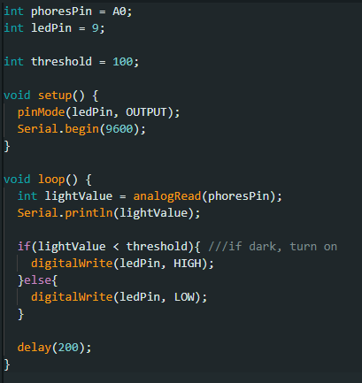
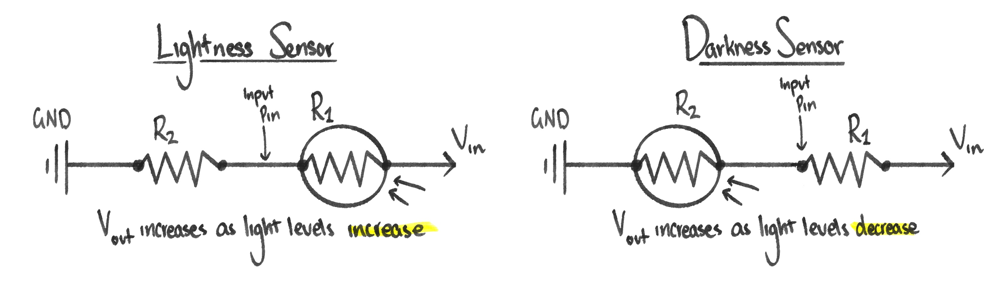
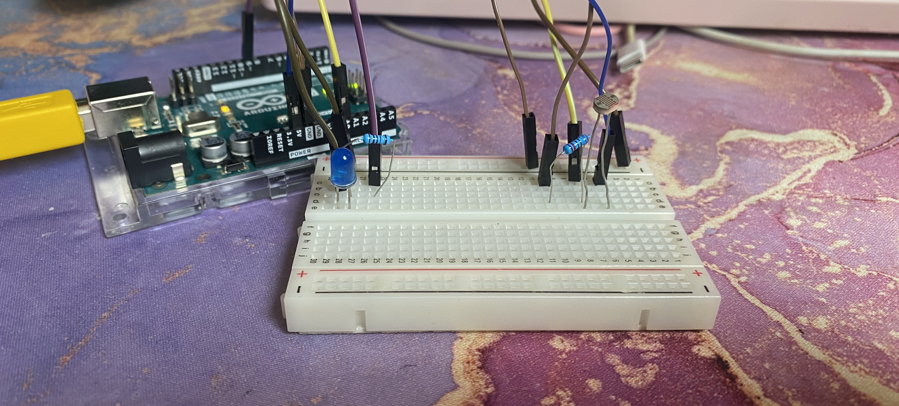
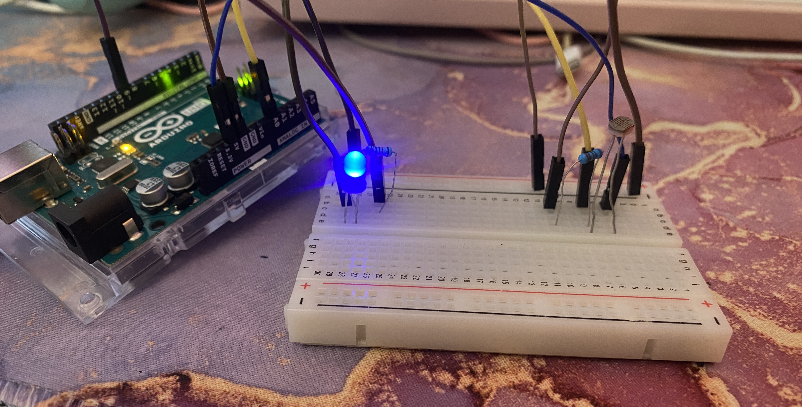
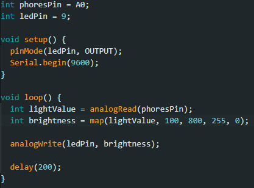
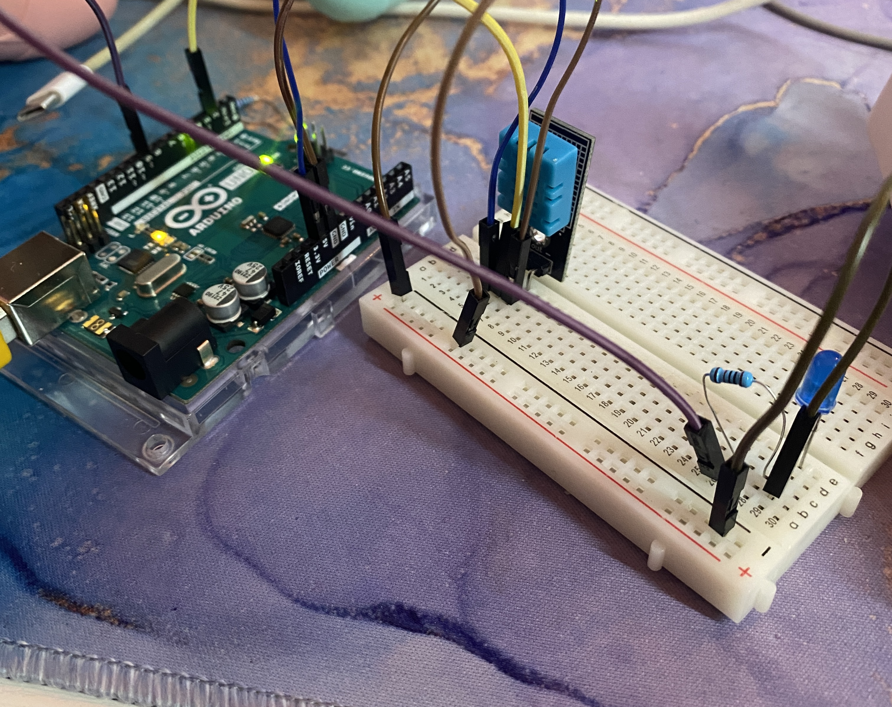
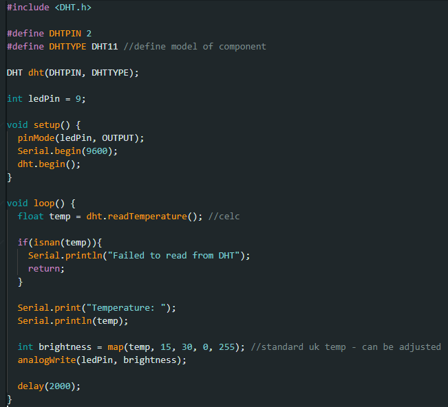

# Entry 5 - Sensors

>### New components used:
>- **Photoresistor** - A two-legged sensor that configures resistance depending on external light levels.
>- **DHT11** - (Digital Humidity and Temperature): A sensor that translates an environments thermal level into digital readings.

With my final project ideas finally on the table, I could begin to think about the logistics of piecing it together. I knew I wanted an environmental variable to have a noticeable impact on my lamp, to ensure an experience that felt relevant and meaningful to each instance of it being used. This meant that said variable needed an outlet for capture, and for this task I turned back to my Arduino kit.

### The Light Experiment

Instantly the sensor that best captured my attention was the **photoresistor**, as an inspiration for my project was the theme and influence of light, and this particular sensor was a direct measure of light and brightness levels. In order to test its capabilities, I began to assemble a basic circuit in a layout highly similar to that used for the potentiometer many experiments ago - alongside a basic IDE program to switch a bulb on/off depending on the levels of light.

I had to tamper with the 'threshold' value to be more responsive to smaller changes in light - such as a curtain being drawn; as my previous value of 500 resulted in a bulb that barely ever changed. Additionally, upon running the script, I found a curious miscalculation. While bulbs serve their greatest purpose in darker spaces (and such was my intention), my bulb only seemed to want to turn on in the light, and off in the darkness - mirroring its environment instead of opposing it. After doing some additional research online, I found that the inclusion and placement of resistors and pins plays a huge roll in the functionality of the photoresistor, and my placement of components on the breadboard had left me with an indicator of lightness, not darkness.

Accordingly, I changed my circuit by providing my sensor with an additional resistor and changing pin configuration. 

>Light **on**, bulb **off**:

>Light **off**, bulb **on**:

This program worked great for illustrating the photoresistor's function. When the value of light (read and translated by the sensor) gets below a certain threshold, the bulb is told to switch on. However, 'on' and 'off' are two static values, either 'yes' or 'no', with the bulb's state jumping between them depending on a single threshold value. This was not reflective of the consistent and responsive vision I had for my mood lamp, and so I decided to modify my script to a more analogue friendly approach.

Once again using my potentiometer script for inspiration, I mapped the light value received by the photoresistor into a 'brightness' variable readable via LED, resulting in a bulb that responded to the inverse of it's environment; decreasing in brightness in real-time as the peripheral brightness increased. This was a vast improvement from the previous digital approach, providing a 'night light' that felt relevant to it's surroundings. I configured the sensor readings as between 100-800, as opposed too the potentiometer's standard 0-1023, in order to increase the visual responsiveness of the circuit (as I otherwise found it nigh impossible to create a space with little enough light to deactivate the bulb, nor enough light to prompt its maximum potential). Testing proved this range to be most reflective of a realistic domestic environment of which a 'mood lamp' is most likely to be found.

### The Heat Experiment

Once I was satisfied with my understanding of potentiometer input - which I intended to use to indicate my mood lamps brightness - there was another key aspect to the project which I still needed to account for; and that aspect was hue. Hue can be essential in amplifying mood and atmosphere, with different tones being associated with different sensations and moods. I wanted my project to incapsulate this correlation, and use it to my advantage. 

I began to think about how this variable could be dictated dynamically. Initially I considered audio, with noises of different volumes and frequencies causing notable shifts in hue. While this could be a great feature for people listening to music, I felt the colour changes would be much too sudden and 'jerked' if they were to reflect all of the many ambient noises in a standard environment, which would not lean into the calm and atmospheric aim of my mood light (especially not when most responsive to upbeat music). Another consideration of mine was the Bluetooth-capable ESP32Feather that I had experimented with previously. I could implement this microcontroller to respond to an app in which users could use a colour wheel to manually select their preferred hue; though I ultimately abandoned this idea as it felt too 'manual' and not environmentally independent.

This brainstorming session revealed the criteria for my next sensor: firstly, it needed to be gradual and subtle to pleasantly make use of a gradient colour wheel, and secondly, it needed to be entirely hands-free. Consulting my tutor, I was recommended the **DHT11** - a heat and humidity sensor which could collect temperature data from an environment and pass it as IDE-readable values. It felt perfect, like the final piece of the puzzle; especially considering the pre-existing temperature associations that colours have (red is warm, blue is cool etc). While the change in temperature is not overly drastic from day-to-day in my country, I knew - like with the photoresistor - that I could configure custom values to better reflect my climate. I also knew that the mood lamp would end up being more of a time indicator, with the intense heat of afternoons contrasting with the coolness of twilight. While somewhat incidental, these features would make my project an authentic reflector of environment; exactly what I intended.

Connecting DHT component to a circuit required the typical trio of wires: ground, voltage and a channel pin for communication, each positioned as instructed by small labels on the sensor (which had its own built-in resistor). Separately, the bulb was configured with its own resistor.

As for the script, I was required to download a custom library for this particular kind of sensor - in addition to defining the model used within the program (which in my case was the 11 as opposed to the 22). The function of the program was as follows: The DHT collects the temperature of it's surroundings in Celsius, printing the result into a serial monitor for viewing/debugging purposes and then mapping this temperature value into the brightness of the bulb. I decided to continue using brightness as my variable for the meantime, as it was less complex to configure and would be an easier indicator of the new sensors success. I used the values '15' and '30' as my range for brightness, as this is the most common range for temperature at my place of residence, therefore easiest to test.

Unfortunately, after much time of unsuccessful rewiring, recreating code, research online and testing with example scripts, I was forced to come to the conclusion that my DHT was faulty, and incapable of reading temperature. No matter what I tried, the Arduino could not access the data coming in from the sensor, nor provide any indication that said data was being collected at all.

While this was unfortunate, as I wouldn't be able to see my experiment - nor my mood lamps 'heat sensitive edition' - properly come to life, I was not willing to abandon this concept that I had been so excited about over a mere piece of faulty hardware. The process of writing the script, assembling the circuit and researching the component had been such valuable insight into the functionality of the DHT, and I was determined to keep it at the heart of my final project; working or not.

With inspired new ideas and hands-on experience under my belt, I was finally ready to undertake the challenge of assembling my final project.

---