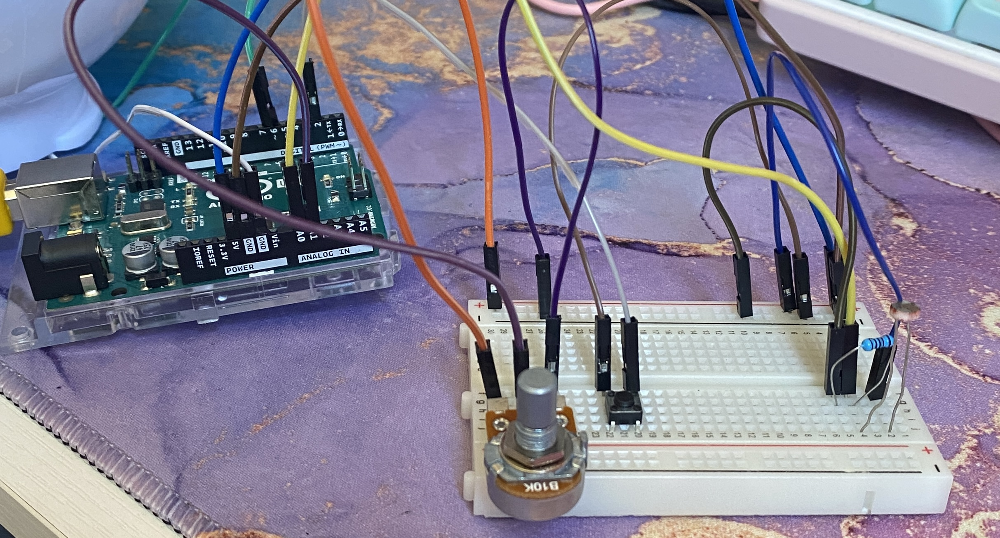
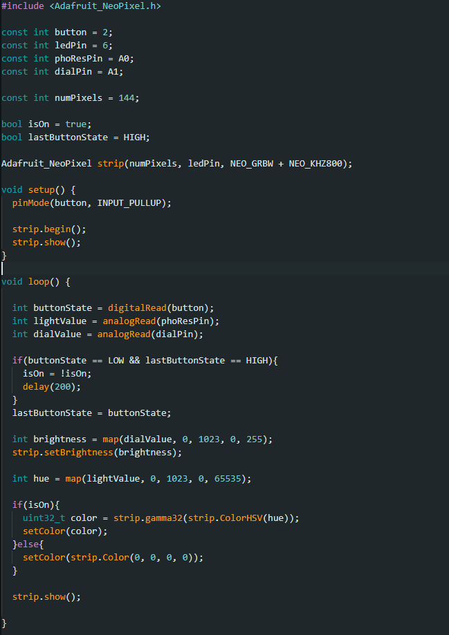
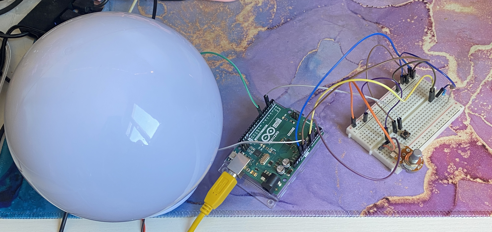
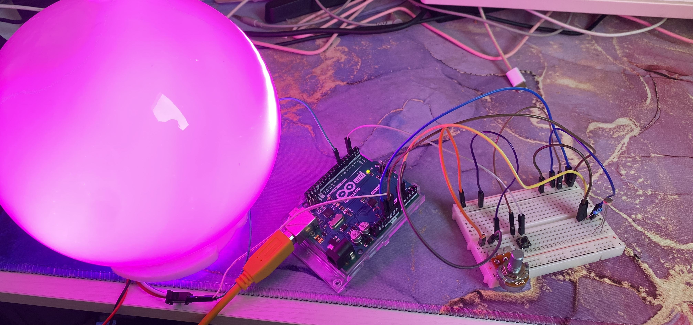

# Entry 6 - Mood Lamp

Looking back on my journey in physical computing, I am astounded by the linearity of my project's origin. Tinkering with hardware, assembling a circuit, becoming acquainted with a microcontroller, these were all pursuits I'd never considered partaking in, but ultimately provided me with a great deal of not only education, but equally gratification and the birth of a genuine interest. Each experiment introduced me to their respective components alongside their nuances and intricacies, and successes and failures equally served to facilitate my understanding on top of my eagerness to include all new gadgets and functionalities within my final project idea.

The introduction to bulbs was a pivotal moment. Seeing a component obeying the laws of my very own written program provided me with a satisfaction great enough to spur me on with each undertaking, and the pleasing visual aspect of this component inspired me to explore a more sophisticated alternative - the LED strip - which has been adopted into my project. The potentiometer experiment introduced me to analogue components and the process of mapping their values to be interpreted and responded to by my bulbs. This procedure has been used in almost every experiment since, formulating my interest in 'environmental influence' which, again, lays at the heart of my final project. the ESP32Feather microcontroller, while not physically used in my "ultimate doodad", provided an invaluable insight into alternative methods of controlling components, and communicating wirelessly; enhancing my awareness of computing on a broader and more modern scale. From that point onwards, I had enough knowledge and inspiration to put together an initial concept, and to familiarise myself with the remaining necessities (such as buttons, sensors and custom libraries). At last, I feel ready to assemble my most informed, most sophisticated, and most purposeful circuit.

---

### The Dial Lamp

Given the unexpected malfunction regarding my DHT11 sensor, my first priority was to create a version of the mood lamp which worked; I could consider potential versions and modifications later. I considered which other analogue component might provide the consistency and responsiveness that I was looking for in a replacement, and my trusty potentiometer would once again rise to the challenge. However, considering that reflecting atmosphere was a primary objective for my lamp, I decided that the user-dependent nature of the dial would prove too 'manual' for a role as important as setting the mood, so I left the task of colour change in the hands of the photoresistor, shifting the potentiometer's role to a pragmatic brightness dial. Additionally, the inclusion of an 'on/off' feature felt indubitable for the sake of power conservation and ease of use, and for that task only a button would suffice.

With the roles of each component decided, it was time to begin assembling. I intentionally positioned all interactive parts (dial, button, photoresistor) at the furthest end of the breadboard from their wires and resistors for ease of finger access and to prevent the sensor's brightness reading from being impacted by either the shadow of other components, or - most notably - the LED strip it'd soon be dictating. All components were standardly wired to one of the Arduino's ground ports, and both the potentiometer and photoresistor provided with 5 volts of electricity. The button was connected to pin 2, the dial to analogue pin A1, and the sensor - inhibited by its own resistor - to A0. These pins would allow each component to be independently read from and accessed by the IDE program I was about to construct.

The LED strip was connected to the Arduino via pin 9, and also granted a ground port. However, the power for this external component was provided with an additional wall socket as the standard Arduino voltage was firstly, in use, and secondly, insufficient.

The script begins with the importing of the NeoPixel library, ensuring the inclusion of all necessary functions for the LED strip's performance. The aforementioned pins are then configured to associate with their respective component as the 'other end' to the communication between hardware and software. More details on the LED strip are then provided, such as number of pixels (in this case 144) as well as the GRBW configuration, to ensure that there wouldn't be any unexpected colour behaviours or bulbs left blank. Unlike my previous LED/button experiment which used an incrementing press counter to activate the bulbs, my mood lamp has static on/off conditions. This feature is represented with two variables: 'isOn' for the current state of the lamp (which starts off), and 'lastButtonState' to indicate which condition was previously met, and therefore needs to be inversed upon the following button press. The strip and pins are then initialised in the setup() function, and the script moves to the core loop.

The logic, which repeats indefinitely, provides a purpose to the hardware, and then prompting results. The current states of all interactive components (button, dial, sensor) is read via their configured pin locations and stored in separate variables. The button is then provided with functionality, reading its last known state (on or off) and then reversing that state upon each physical click of the hardware. If isOn is currently untrue - indicating the lamp is in an **off** state - and the button is pressed again, this tells the program that isOn is now true, and the lamp should now be in its **on** state, with the meaning of this state provided later in the script.

Next, the lamp's brightness value is dictated. The dialValue, which serves as the analogue reading constantly responding to the potentiometer dials rotation amount, is in the range of 0-1023 (with 0 representing a full rotation to the left - or the lowest value - and 1023 representing the opposite). This range would then need to be mapped into the spectrum of values between 0-255, as this is the only range that the LED strip can interpret brightness, with the value 255 acting as a maximum. This newly mapped edition of the potentiometer's rotation is then stored in a 'brightness' variable, which is passed to the LED strip outside of the isOn condition, ensuring that the dial is still responded to and recognised independent of the strip's activation.

Furthermore, the lamp's hue must be accounted for; this feature ultimately being handled in a similar way. The lightValue representing  the environment's light levels is read by the potentiometer and collected in values between 0-1023. However, this range must instead be mapped to represent values between 0-65535, as that is the full extend of hexadecimal values in the 16-bit colour parameter that my LED strip operates on, ensuring my mood lamp is provided with the entire available colour wheel. This mapped value is stored within a 'hue' variable. 

All three of these variables: iOn, brightness and hue, are collected in real-time, repeatedly tested for in an indefinite loop to ensure that any updates or changes to any hardware components is immediately reflected; and only after their successful collection can the lamp respond. This is then done by testing if the isOn value is currently true. If this condition is met, the colour value of the LED strip is passed the value of the hue variable, setting all of the bulbs to that particular hex code via a pre-initialised NeoPixel function. This value changes in correlation to the surrounding brightness levels - with red indicating absolute lightness and green indicating absolute darkness - causing the hex codes to shift in a pleasing colour gradient between these values depending on what the photoresistor receives. This continues until isOn is no longer true (the button has been pressed again) and the condition is no longer met, instructing the LED strip to become inactive and without colour.

The combination of this script and circuit resulted in a fully functional mood lamp: a button that prompts/dispels LED illumination, a dial that alters brightness immediately and cohesively, and a lightness sensor that uses environmental light levels to shift the lamp's hue around the entire colour wheel in a gradual and aesthetic progression. It was pleasing, it was responsive, it was reactive - everything that I set out to accomplish; and yet still, potential improvements were practically jumping out at me.

Something I had failed to consider in it's entirety was the user experience. Sure my lamp responded well and the colours were pretty, but there was still something primitive about it. The light strip was incredibly bright - almost overbearing - and gave the impression of a series of disorganised individual bulbs as opposed to one unit, not to mention that all wires and circuitry was bare and exposed, delicate. I wanted to bring it all together, to polish it, to turn it into a project instead of a ragtag cluster of components and code; this was my final creation, after all.

To combat the issue of the light's appearance, I initially turned to a spare lamp shade I had at home: a spherical glass dome into which I folded the LED strip in hopes of making it resemble a more singular component. While it was successful in served this purpose, the transparent glass material not only displayed a tangled mess of bulbs inside, but it made the glare even worse! There was condensed light bouncing around inside, leaking from some spots, shadowed in others, I knew I couldn't allow this. However, I was incredibly fond of the spherical form, it was sleek and aesthetically pleasing, adhering to my ambient mood lamp motivations. This inspired me to browse online, and I eventually found a lamp shade of the same shape and dimensions, except made of plastic and resin. Putting my LED strip within this new lamp proved a roaring success, with the opaque off-white shell providing a diffuser for my lights, reducing their glare and distributing their colour evenly over a charmingly round globe.

>Light **off**:

>Light **on**:

However this improvement didn't tackle the circuits nakedness. I initially just secured both the Arduino and breadboard of components inside of a cardboard box with Blu Tack, cutting a hole in the side for the USB-C wire to escape so that the microcontroller could be plugged into my PC, as well as the LEDs power plug into the wall; yet this method presented two fatal flaws. Firstly, the user would have to reach inside the box and feel around in order to access the on button and the brightness dial - which not only combatted the point of the box (to improve user experience) but also, on occasion, lead to wires being pulled loose and disconnecting the lamp entirely. Yet the second (and most important) flaw was that the lightness sensor was stuffed inside a dark box, receiving no light and thus preventing any hue shift or response of any kind.

To combat both of these urgent issues, I sliced another small opening in the front of my box. I knew the button, dial and sensor had to be accessible and open to the outside world and yet I still wanted the remainder of the wiring to be concealed for visual enhancement. So, using the distant positioning of interactive components that I mentioned earlier, I slid only this edge of the breadboard out of the opening, revealing these components alone, and then carefully folded the top face of the sliced opening back down to stand in front of the circuit's remainder. What needed to be accessed was accessible, what didn't was not. The Blu Tack held everything in place to reduce the delicate flimsiness of the circuit as a whole, and the box acted as both a layer of protection, and reduction of visual clutter - as well as a way to shield the photoresistor from the bulb's influence. Finally, I pulled the LED strip through a small opening at the top, placing them back inside the lamp shade and taping its base onto the box. A single entity and a completed project.

**SEE MOOD LAMP VIDEO RESOURCE ATTACHED IN FOLDER**

### The Temperature Lamp

Even with a working product in front of me, there was one construct that I just couldn't seem to put to rest; and that was the influence of the heat and humidity sensing DHT11. I was frustrated that the vision for my final creation had been limited by something as crude as a faulty part; that just wasn't an outcome I could accept, so I began to modify.

It was all theoretical, I could never get it to work without a functioning DHT sensor, and yet the urge to breathe life into my original objective was far greater than the need for any tangible result. The circuit would be easy to rearrange, replacing the three-pronged potentiometer from the breadboard with the DHT in its exact place, simply swapping the position of the ground and voltage wires. The program, however, would pose more of a challenge.

The DHT library would need to be included in order for the heat sensor's readings to be correctly interpreted and responded to, and the model (DHT11) would need defining explicitly within the script. Like the LED strip, the DHT would need to be initialised in the setup() function as well. The state of the button and photoresistor would be read and stored as usual, and yet my initial intention was to have the brightness of the environment be responsible for the alteration of the LED's brightness, not its hue as is the case in the lamp's previous instance. This change would need to be reflected within the program, and the photoresistor's reading would need to be mapped into a brightness value, not a hexadecimal value.

The humidity sensor would then be prompted for a reading value in Celsius, which would be stored in its own 'temp' variable. This value would then be constrained amidst - in my case - the standard British temperature range, and promptly mapped between values of 0-21845. I use this particular value as it is reflective of a greenish hue, ensuring that warmish tones remain in the red-orange scheme, with the lamp's hue heading into cooler blue-greens as temperature drops; providing a semantic influence for the hue shift and leaning further into the influence and representation of heat.

The lamp then turns on when prompted by the button, displaying the newly configured heat-sensitive palette, with bulb brightness inverting the environment's, and power governed by an on/off button.

Despite its lack of feedback, I somehow felt more attached to this version of my creation. Multiple sensors ensured that changes to surroundings would have an impact, but the logic and semantic response to these changes were what created a _meaningful_ impact. Red means hot, blue means cold, night means bright, day means dim; it just made sense, felt right. It was what I had envisioned and hoped for in my final project, and I was proud of it.

---

### My Final Thoughts

The mood lamp cannot be dissected into either variant; it is both. One (which we will call 'Model A'), a tangible, functional device that interprets multiple instances of analogue and digital input to respond in an array of hues. And the other ('Model B'), a theoretical heat/light simulation that acts as a visual environment representative. Both come with successes and limitations.

Model A is assembled soundly, with a working script and circuit. Wires are ordered neatly - making use of breadboard ground and voltage power rails - and interactive elements are spatially separated - increasing accessibility and opening the door for peripheral enhancements. These enhancements (the box and lamp shade) protect the components improving overall robustness, in addition to providing a tidy, aesthetic finish. The script is organised and concise, with the collection of component data happening immediately and simultaneously, and this data then being tested for in a sensible, chronological arrangement. However, while it works, this model sports less semantic significance, and less personal intention. The potentiometer was used as a last minute replacement, and has no real contribution to my 'automatic' and 'environmentally-dictated' direction. The brightness sensor's influence over hue, while easy to assess and pleasing to view, feels random and purposeless.

Model B, on the contrary, combats these issues. It gives meaning and association to hues, and provides a clear purpose for the entire device: to illuminate dark spaces. It's dual-sensor setup ensures that every environment provokes a different visual response. Its only setback? It doesn't exist.

Both models adhere to my two intended destinations: pretty colours, and external influence. That, in my opinion, makes them both successful. Combining techniques from all walks of my creative computing journey, with analogue mapping remaining consistent from the start as opposed to the use of sophisticated LED technology - which came much later - this final project perfectly encompasses everything I have worked on, and been most interested in.

Moving forward, I would, first and foremost, obtain a working DHT11 sensor in order to realise my more complex model. I also think that both scripts could benefit from some failsafe logic and debugging - such as faulty component warnings and NaN readings; an important influence which introduced itself 'hard way' upon the failure of my heat sensor. Additionally, I would weld the wires into place to eliminate any worries of flimsy circuitry in transit, and reduce the box size to better suit the scale of the Arduino.

As I mentioned previously, my learning process has been linear. Contrary to my initial beliefs, the setbacks and mistakes directly aided my understanding, and proficiency in handling all forthcoming experimentation. The whole journey was an upwards slope of curiosity from the absolute fundamentals of the Arduino board and of the broader concept of hardware, to constructing a final project that, while certainly imperfect, is mine.